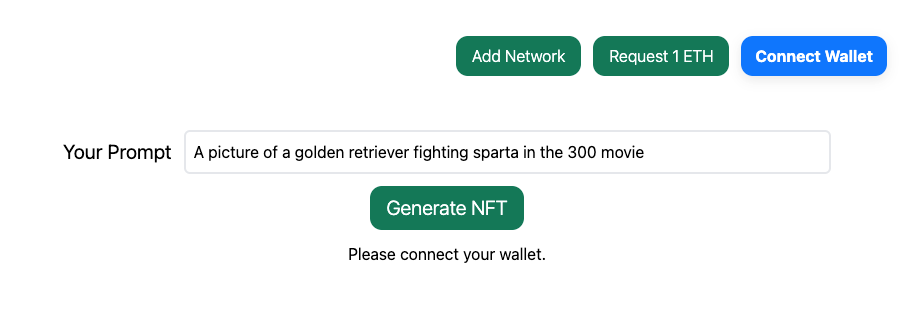
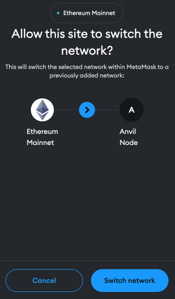
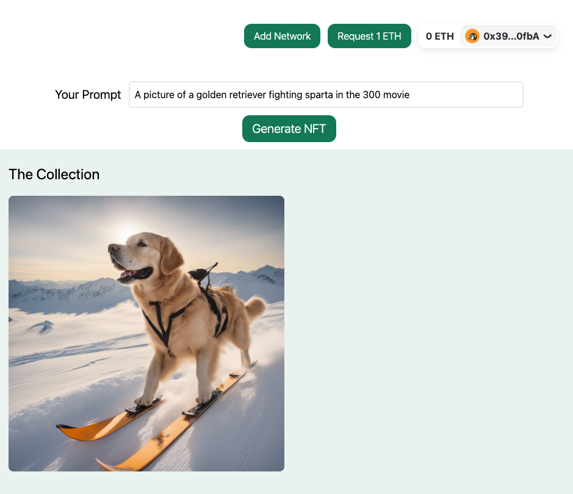
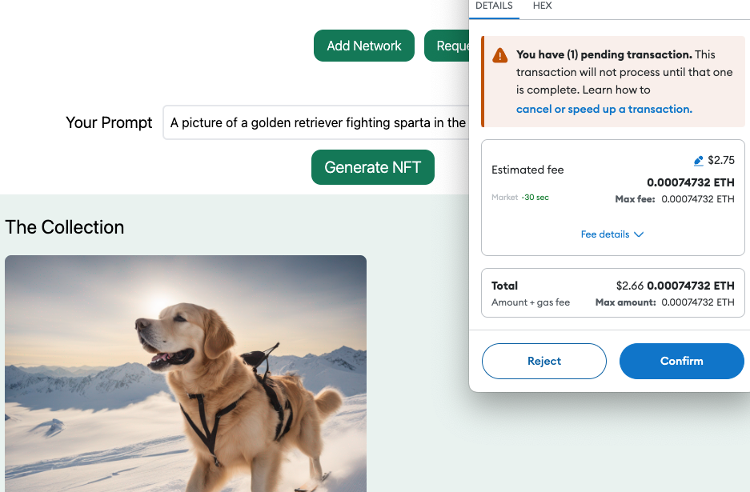
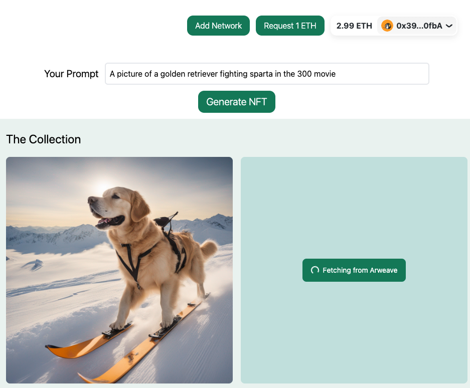
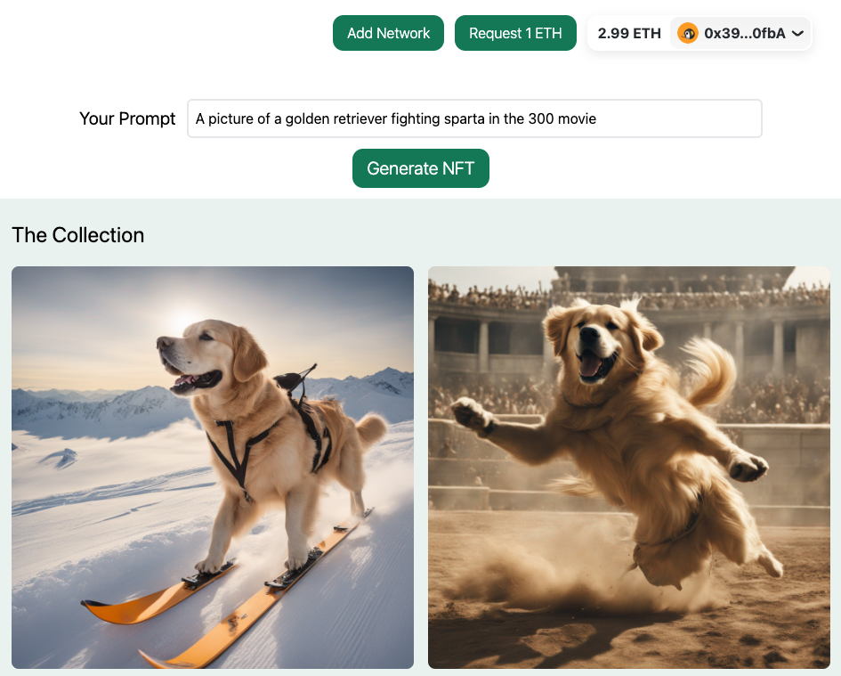

# Prompt to NFT

In this tutorial we are going to create a dapp where we can generate NFT's by a single prompt from the user. This
project has many components:

1. A service that runs Stable Diffusion.
2. A NextJS frontend that connects to the local Anvil node
3. An NFT smart contract which is also a [Infernet Consumer](https://docs.ritual.net/infernet/sdk/consumers/Callback).
4. An Infernet container which collects the prompt, calls the Stable Diffusion service, retrieves the NFT and uploads it
   to Arweave.
5. An anvil node to which we will deploy the NFT smart contract.

## Install Pre-requisites

For this tutorial you'll need to have the following installed.

1. [Docker](https://docs.docker.com/engine/install/)
2. [Foundry](https://book.getfoundry.sh/getting-started/installation)

## Setting up a stable diffusion service

Included with this tutorial, is a [containerized stable-diffusion service](./stablediffusion).

### Rent a GPU machine
To run this service, you will need to have access to a machine with a powerful GPU. In the video above, we use an
A100 instance on [Paperspace](https://www.paperspace.com/).

### Install docker
You will have to install docker.

For Ubuntu, you can run the following commands:

```bash copy
# install docker
sudo apt-get install docker-ce docker-ce-cli containerd.io docker-buildx-plugin docker-compose-plugin
```
As docker installation may vary depending on your operating system, consult the
[official documentation](https://docs.docker.com/engine/install/ubuntu/) for more information.

After installation, you can verify that docker is installed by running:

```bash
# sudo docker run hello-world
Hello from Docker!
```

### Ensure CUDA is installed
Depending on where you rent your GPU machine, CUDA is typically pre-installed. For Ubuntu, you can follow the
instructions [here](https://docs.nvidia.com/cuda/cuda-installation-guide-linux/index.html#prepare-ubuntu).

You can verify that CUDA is installed by running:

```bash copy
# verify Installation
python -c '
import torch
print("torch.cuda.is_available()", torch.cuda.is_available())
print("torch.cuda.device_count()", torch.cuda.device_count())
print("torch.cuda.current_device()", torch.cuda.current_device())
print("torch.cuda.get_device_name(0)", torch.cuda.get_device_name(0))
'
```

If CUDA is installed and available, your output will look similar to the following:

```bash
torch.cuda.is_available() True
torch.cuda.device_count() 1
torch.cuda.current_device() 0
torch.cuda.get_device_name(0) Tesla V100-SXM2-16GB
```

### Ensure `nvidia-container-runtime` is installed
For your container to be able to access the GPU, you will need to install the `nvidia-container-runtime`.
On Ubuntu, you can run the following commands:

```bash copy
# Docker GPU support
# nvidia container-runtime repos
# https://nvidia.github.io/nvidia-container-runtime/
curl -s -L https://nvidia.github.io/nvidia-container-runtime/gpgkey | \
sudo apt-key add - distribution=$(. /etc/os-release;echo $ID$VERSION_ID)
curl -s -L https://nvidia.github.io/nvidia-container-runtime/$distribution/nvidia-container-runtime.list | \
sudo tee /etc/apt/sources.list.d/nvidia-container-runtime.list
sudo apt-get update

# install nvidia-container-runtime
# https://docs.docker.com/config/containers/resource_constraints/#gpu
sudo apt-get install -y nvidia-container-runtime
```
As always, consult the [official documentation](https://nvidia.github.io/nvidia-container-runtime/) for more
information.

You can verify that `nvidia-container-runtime` is installed by running:

```bash copy
which nvidia-container-runtime-hook
# this should return a path to the nvidia-container-runtime-hook
```

Now, with the pre-requisites installed, we can move on to setting up the stable diffusion service.

### Clone this repository

```bash copy
# Clone locally
git clone --recurse-submodules https://github.com/ritual-net/infernet-container-starter
# Navigate to the repository
cd infernet-container-starter
```

### Build the Stable Diffusion service

This will build the `stablediffusion` service container.
```bash copy
make build-service project=prompt-to-nft service=stablediffusion
```

### Run the Stable Diffusion service
```bash copy
make run-service project=prompt-to-nft service=stablediffusion
```

This will start the `stablediffusion` service. Note that this service will have to download a large model file,
so it may take a few minutes to be fully ready. Downloaded model will get cached, so subsequent runs will be faster.


## Setting up the Infernet Node along with the `prompt-to-nft` container

You can follow the following steps on your local machine to setup the Infernet Node and the `prompt-to-nft` container.

### Ensure `docker` & `foundry` exist
To check for `docker`, run the following command in your terminal:
```bash copy
docker --version
# Docker version 25.0.2, build 29cf629 (example output)
```

You'll also need to ensure that docker-compose exists in your terminal:
```bash copy
which docker-compose
# /usr/local/bin/docker-compose (example output)
```

To check for `foundry`, run the following command in your terminal:
```bash copy
forge --version
# forge 0.2.0 (551bcb5 2024-02-28T07:40:42.782478000Z) (example output)
```

### Clone the starter repository
Just like our other examples, we're going to clone this repository.
All of the code and instructions for this tutorial can be found in the
[`projects/prompt-to-nft`](./prompt-to-nft)
directory of the repository.

```bash copy
# Clone locally
git clone --recurse-submodules https://github.com/ritual-net/infernet-container-starter
# Navigate to the repository
cd infernet-container-starter
```

### Configure the `prompt-to-nft` container

#### Configure the URL for the Stable Diffusion service
The `prompt-to-nft` container needs to know where to find the stable diffusion service. To do this, we need to
modify the configuration file for the `prompt-to-nft` container. We have a sample [config.sample.json](./container/config.sample.json) file.
Simply navigate to the [`projects/prompt-to-nft/container`](./container) directory and set up the config file:

```bash
cd projects/prompt-to-nft/container
cp config.sample.json config.json
```

In the `containers` field, you will see the following:

```json
"containers": [
    {
        // etc. etc.
        "env": {
            "ARWEAVE_WALLET_FILE_PATH": "/app/wallet/keyfile-arweave.json",
            "IMAGE_GEN_SERVICE_URL": "http://your.services.ip:port" // <- replace with your service's IP and port
        }
    }
},
```

#### Configure the path to your Arweave wallet

Create a directory named `wallet` in the `container` directory and place your Arweave wallet file in it.

```bash
mkdir wallet
cp /path/to/your/arweave-wallet.json wallet/keyfile-arweave.json
```

By default the `prompt-to-nft` container will look for a wallet file at `/app/wallet/keyfile-arweave.json`. The `wallet`
directory you have created, will get copied into your docker file at the build step below. If your wallet filename is
different, you can change the `ARWEAVE_WALLET_FILE_PATH` environment variable in the `config.json` file.

```json
"containers": [
    {
        // etc. etc.
        "env": {
            "ARWEAVE_WALLET_FILE_PATH": "/app/wallet/keyfile-arweave.json", // <- replace with your wallet file name
            "IMAGE_GEN_SERVICE_URL": "http://your.services.ip:port"
        }
    }
},
```

### Build the `prompt-to-nft` container

First, navigate back to the root of the repository. Then simply run the following command to build the `prompt-to-nft`
container:

```bash copy
cd ../../..
make build-container project=prompt-to-nft
```

### Deploy the `prompt-to-nft` container with Infernet

You can run a simple command to deploy the `prompt-to-nft` container along with bootstrapping the rest of the
Infernet node stack in one go:

```bash copy
make deploy-container project=prompt-to-nft
```

### Check the running containers

At this point it makes sense to check the running containers to ensure everything is running as expected.

```bash
# > docker container ps
CONTAINER ID IMAGE COMMAND CREATED STATUS PORTS NAMES
0dbc30f67e1e ritualnetwork/example-prompt-to-nft-infernet:latest "hypercorn app:creat…" 8 seconds ago Up 7 seconds
0.0.0.0:3000->3000/tcp prompt-to-nft
0c5140e0f41b ritualnetwork/infernet-anvil:0.0.0 "anvil --host 0.0.0.…" 23 hours ago Up 23 hours
0.0.0.0:8545->3000/tcp anvil-node
f5682ec2ad31 ritualnetwork/infernet-node:latest "/app/entrypoint.sh" 23 hours ago Up 9 seconds
0.0.0.0:4000->4000/tcp deploy-node-1
c1ece27ba112 fluent/fluent-bit:latest "/fluent-bit/bin/flu…" 23 hours ago Up 10 seconds 2020/tcp,
0.0.0.0:24224->24224/tcp, :::24224->24224/tcp deploy-fluentbit-1
3cccea24a303 redis:latest "docker-entrypoint.s…" 23 hours ago Up 10 seconds 0.0.0.0:6379->6379/tcp,
:::6379->6379/tcp deploy-redis-1
```

You should see five different images running, including the Infernet node and the prompt-to-nft container.

## Minting an NFT by directly calling the consumer contract

In the following steps, we will deploy our NFT consumer contract and call it using a forge script to mint an NFT.

### Setup

Notice that in [one of the steps above](#check-the-running-containers) we have an Anvil node running on port `8545`.

By default, the [`anvil-node`](https://hub.docker.com/r/ritualnetwork/infernet-anvil) image used deploys the
[Infernet SDK](https://docs.ritual.net/infernet/sdk/introduction) and other relevant contracts for you:
- Registry: `0x663F3ad617193148711d28f5334eE4Ed07016602`
- Primary node: `0x70997970C51812dc3A010C7d01b50e0d17dc79C8`

### Deploy our NFT Consumer contract

In this step, we will deploy our NFT consumer contract to the Anvil node. Our [`DiffusionNFT.sol`](./contracts/src/DiffusionNFT.sol)
contract is a simple ERC721 contract which implements our consumer interface.


#### Anvil logs

During this process, it is useful to look at the logs of the Anvil node to see what's going on. To follow the logs,
in a new terminal, run:

```bash copy
docker logs -f anvil-node
```

#### Deploying the contract

Once ready, to deploy the [`DiffusionNFT`](./contracts/src/DiffusionNFT.sol) consumer contract, in another terminal, run:

```bash copy
make deploy-contracts project=prompt-to-nft
```

You should expect to see similar Anvil logs:

```bash
# > make deploy-contracts project=prompt-to-nft

eth_getTransactionReceipt

Transaction: 0x0577dc98192d971bafb30d53cb217c9a9c16f92ab435d20a697024a4f122c048
Contract created: 0x13D69Cf7d6CE4218F646B759Dcf334D82c023d8e
Gas used: 1582129

Block Number: 1
Block Hash: 0x1113522c8422bde163f21461c7c66496e08d4bb44f56e4131c2af57f8457f5a5
Block Time: "Wed, 6 Mar 2024 05:03:45 +0000"

eth_getTransactionByHash
```

From our logs, we can see that the `DiffusionNFT` contract has been deployed to address
`0x13D69Cf7d6CE4218F646B759Dcf334D82c023d8e`.

### Call the contract

Now, let's call the contract to mint an NFT! In the same terminal, run:

```bash copy
make call-contract project=prompt-to-nft prompt="A golden retriever skiing."
```

You should first expect to see an initiation transaction sent to the `DiffusionNFT` contract:

```bash

eth_getTransactionReceipt

Transaction: 0x571022944a1aca5647e10a58b2242a83d88f2e54dca0c7b4afe3c4b61fa3faf6
Gas used: 214390

Block Number: 2
Block Hash: 0x167a45bb2d30ab3732553aafb1755a3e126b2e1ae7ef52ca96bd75acb0eeb5eb
Block Time: "Wed, 6 Mar 2024 05:06:09 +0000"

```
Shortly after that you should see another transaction submitted from the Infernet Node which is the
result of your on-chain subscription and its associated job request:

```bash
eth_sendRawTransaction
_____  _____ _______ _    _         _
|  __ \|_   _|__   __| |  | |  /\   | |
| |__) | | |    | |  | |  | | /  \  | |
|  _  /  | |    | |  | |  | |/ /\ \ | |
| | \ \ _| |_   | |  | |__| / ____ \| |____
|_|  \_\_____|  |_|   \____/_/    \_\______|


nft minted! https://arweave.net/<arweave-hash>
nft id 1
nft owner 0x1804c8AB1F12E6bbf3894d4083f33e07309d1f38

Transaction: 0xcaf67e3f627c57652fa563a9b6f0f7fd27911409b3a7317165a6f5dfb5aff9fd
Gas used: 250851

Block Number: 3
Block Hash: 0xfad6f6743bd2d2751723be4c5be6251130b0f06a46ca61c8d77077169214f6a6
Block Time: "Wed, 6 Mar 2024 05:06:18 +0000"

eth_blockNumber
```

We can now confirm that the address of the Infernet Node (see the logged `node` parameter in the Anvil logs above)
matches the address of the node we setup by default for our Infernet Node.

We can also see that the owner of the NFT is `0x1804c8AB1F12E6bbf3894d4083f33e07309d1f38` and the NFT has been minted
and uploaded to Arweave.

Congratulations! 🎉 You have successfully minted an NFT!

## Minting an NFT from the UI

This project also includes a simple NextJS frontend that connects to the local Anvil node. This frontend allows you to
connect your wallet and mint an NFT by providing a prompt.

### Pre-requisites
Ensure that you have the following installed:
1. [NodeJS](https://nodejs.org/en)
2. A node package manager. This can be either `npm`, `yarn`, `pnpm` or `bun`. Of course, we recommend `bun`.

### Run the UI

From the top-level directory of the repository, simply run the following command:

```bash copy
make run-service project=prompt-to-nft service=ui
```

This will start the UI service. You can now navigate to `http://localhost:3001` in your browser to see the UI.
j

### Connect your wallet
By clicking "Connect Wallet", your wallet will also ask you to switch to our anvil testnet. By accepting, you will be
connected.


Here, you should also see the NFT you minted earlier through the direct foundry script.



### Get Some ETH

To be able to mint the NFT, you will need some ETH. You can get some testnet ETH the "Request 1 ETH" button at
the top of the page. If your balance does not update, you can refresh the page.

### Enter a prompt & mint a new NFT
You can now enter a prompt and hit the "Generate NFT" button. A look at your anvil-node & infernet-node logs will
show you the transactions being sent and the NFT being minted. The newly-minted NFT will also appear in the UI.



Once your NFT's been generated, the UI will attempt to fetch it from arweave and display it. This usually takes less
than a minute.



And there you have it! You've minted an NFT from a prompt using the UI!

